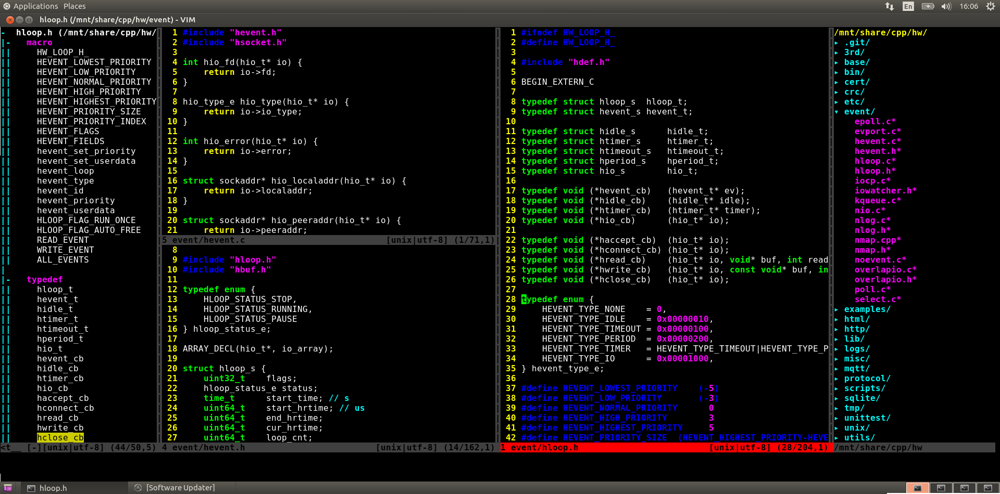

# INTRO

ithewei's .vimrc

# INSTALL
```
git clone https://github.com/ithewei/vimrc.git ~/.vim
cd ~/.vim
./install.sh

vim
:PluginInstall
```

# USAGE
```
cd ProjectDir
~/.vim/cscopetag.sh
~/.vim/ycm.sh
vim
<F2>
<F3>
```

# ENJOY

